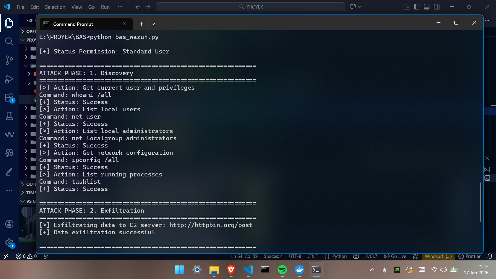
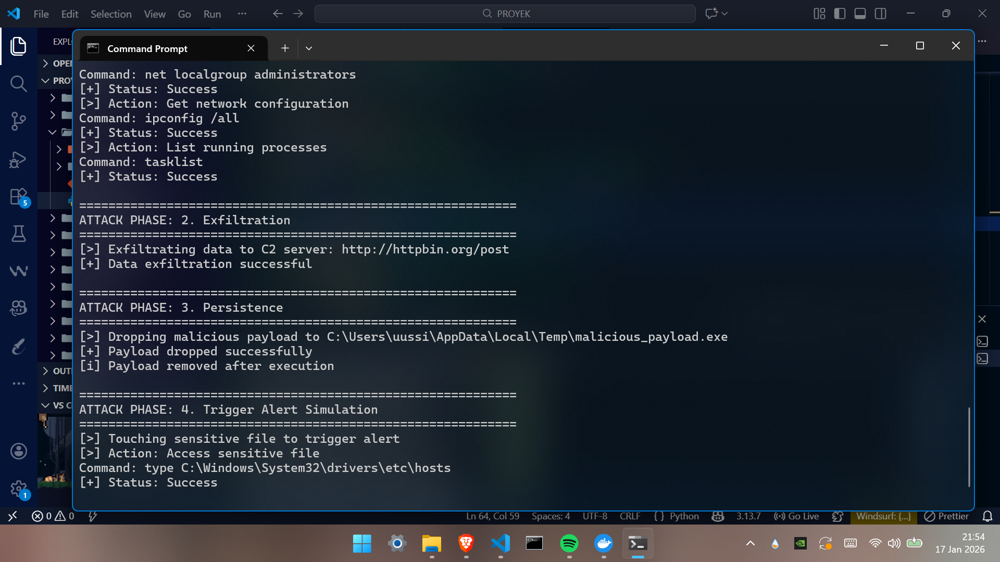
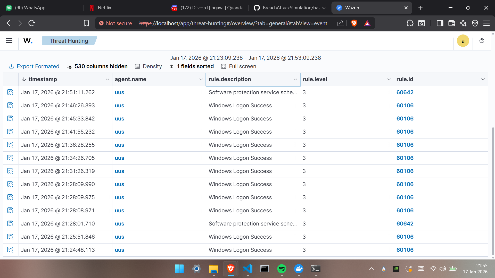

# Breach & Attack Simulation

## Overview

This repository contains a lightweight Breach and Attack Simulation script designed to validate the detection capabilities of the Wazuh SIEM. The script mimics real-world adversary behaviors—such as reconnaissance, data exfiltration, and persistence mechanisms—on a Windows endpoint. By executing these controlled actions, security analysts can verify if their Wazuh agents are correctly forwarding events and if the SIEM rules are triggering alerts as expected.

## Key Features 

### 1. Discovery 
* Simulates an attacker gathering system information.
* Actions: `whoami /all`, `net user`, `ipconfig /all`, and `tasklist`.
* Goal: Generate logs related to suspicious command-line reconnaissance (MITRE T1087, T1082).

### 2. Data Exfiltration
* Simulates the theft of sensitive data to an external C2 server.
* Actions: Sends a JSON payload containing dummy credentials and credit card numbers to a public endpoint (`httpbin.org`).
* Goal: Test network detection rules for sensitive data leakage.

### 3. Persistence
* Simulates a malware drop attempt.
* Actions: Writes a dummy executable `malicious_payload.exe` to the `%TEMP%` directory and immediately deletes it.
* Goal: Trigger File Integrity Monitoring (FIM) or malware detection alerts.

### 4. Sensitive File Access
* Simulates unauthorized access to critical system files.
* Actions: Reads the Windows hosts file `C:\Windows\System32\drivers\etc\hosts`.
* Goal: Trigger alerts for accessing sensitive system configurations.

## Architecture

1.  **Simulation Execution**
    * The `bas_wazuh.py` script runs on the Windows Endpoint, executing system shell commands, creating files, and making network requests to mimic adversary behavior.

2.  **Event Capture**
    * The Wazuh Agent monitors system activities (process creation, file modification, network connections) and captures the "noise" generated by the script.

3.  **Log Forwarding & Analysis**
    * The Agent forwards the logs to the Wazuh Manager/Server.
    * The Manager correlates these logs against security rules (e.g., MITRE ATT&CK mapping) to generate alerts and visualize the attack in the dashboard.

## Demo & Proof of Concept

### 1. Execution
The script was executed on a Windows 11 endpoint with a standard user privilege. As shown below, it successfully cycled through all 4 phases—performing reconnaissance, sending dummy data to the C2 server, and dropping a test payload.

### 2. Detection
The Wazuh Agent installed on the endpoint ("uus") successfully captured the system events generated by the script. The screenshot below shows the Wazuh Dashboard receiving real-time logs from the victim machine during the simulation timeframe.

## Prerequisites

* Windows 10/11
* Wazuh Agent
* Python 3+

---
Created by: Yustinus Hendi Setyawan
Date: Monday, December 22 2025