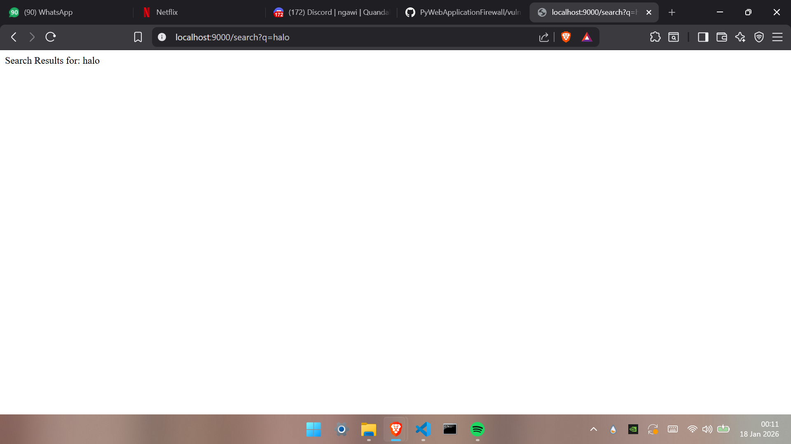
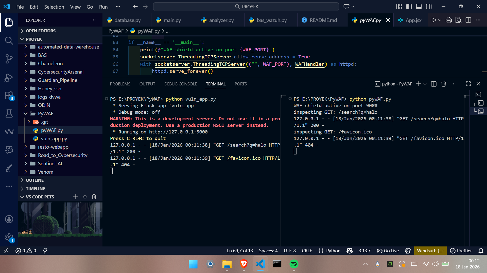
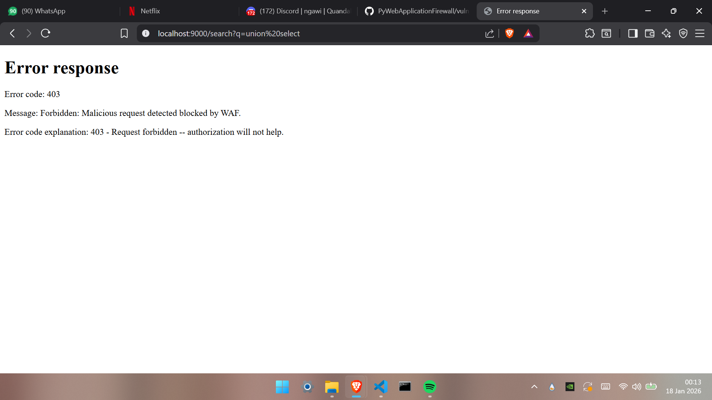
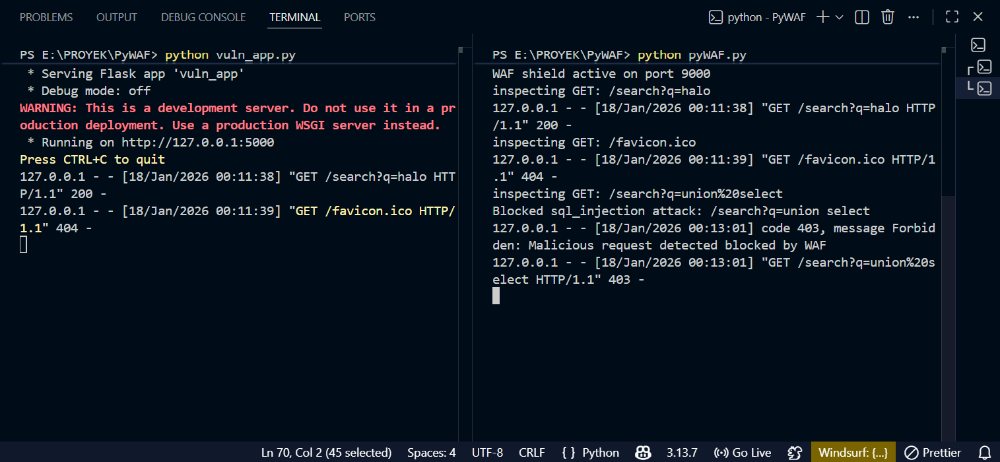
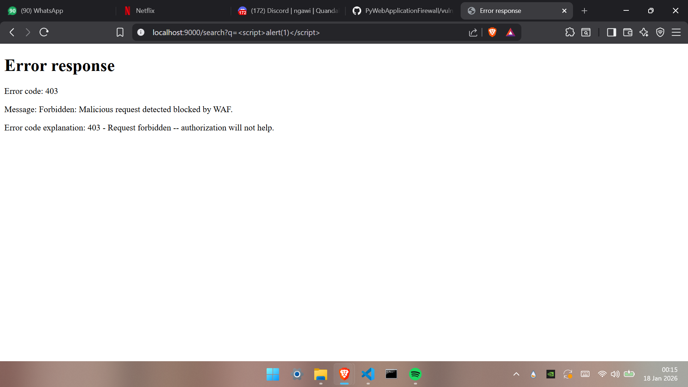
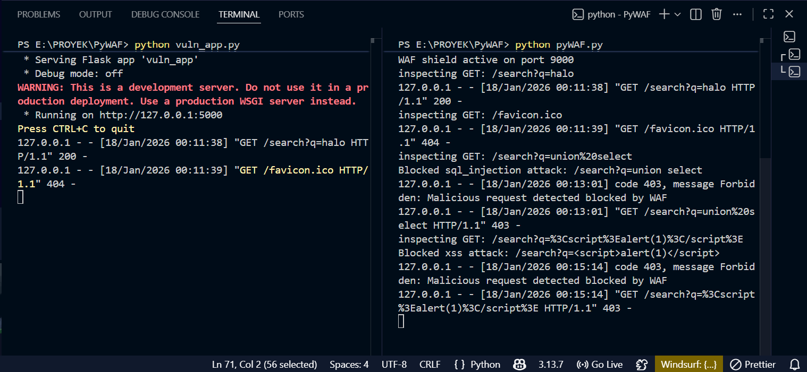
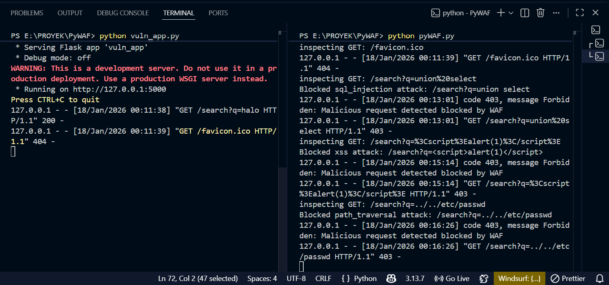

# PyWAF (Python Web Application Firewall)

## Overview

PyWAF is a custom-built, lightweight Web Application Firewall (WAF) designed to protect web servers from common Layer 7 attacks. Acting as a Reverse Proxy, PyWAF sits in front of the vulnerable application, intercepting all incoming HTTP requests. It performs Deep Packet Inspection on the request URL and body, using Regex-based signatures to detect and block malicious payloads—specifically targeting the OWASP Top 10 vulnerabilities like SQL Injection, Cross-Site Scripting (XSS), and Path Traversal—before they reach the backend server.

## Key Features

### 1. Reverse Proxy Engine
* Intercepts client traffic on port `9000` and forwards legitimate requests to the backend application on port `5000`.
* Hides the origin server's identity and provides a single point of entry for security filtering.

### 2. SQL Injection Defense
* Inspects query parameters for malicious SQL patterns.
* Blocks Keywords like `UNION`, `SELECT`, `--`, and hex sequences used to manipulate database queries.

### 3. XSS Mitigation
* Sanitizes and blocks requests containing malicious script tags.
* Blocks ``).
* Payload: `?q=`
* Status: `403 Forbidden`

### 4. Path Traversal Attack
An attempt to step back directories to read system files (`../etc/passwd`).
* Payload: `?q=../../etc/passwd`
* Status: `403 Forbidden`

## Prerequisites

* Python 3+
* Flask

---
Created by: Yustinus Hendi Setyawan
Date: Monday, December 22 2025