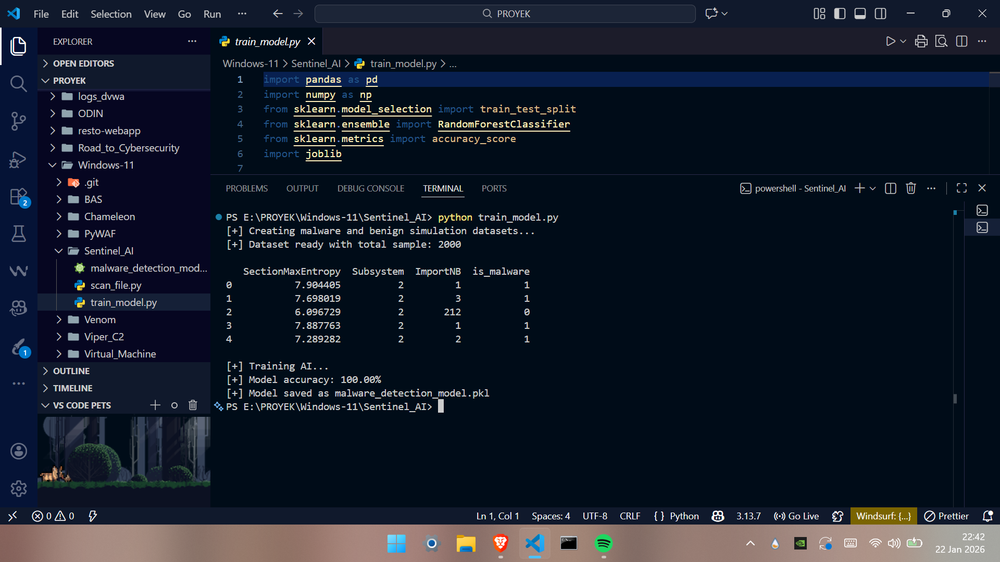
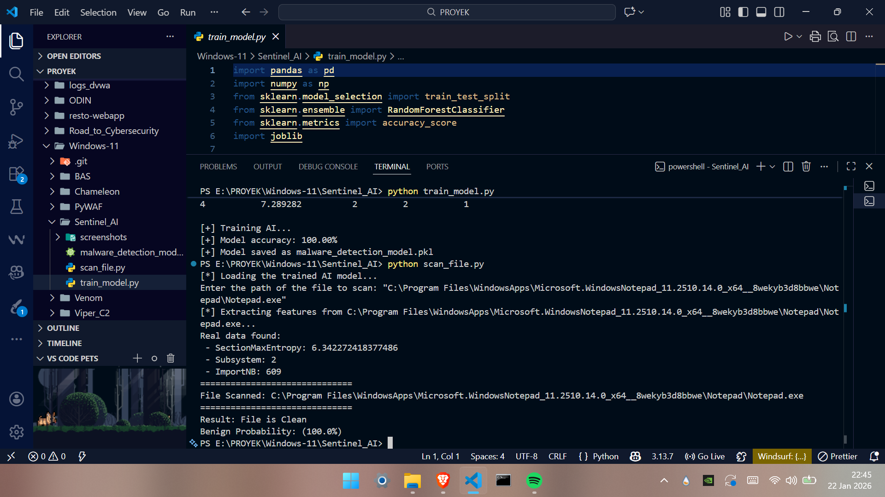
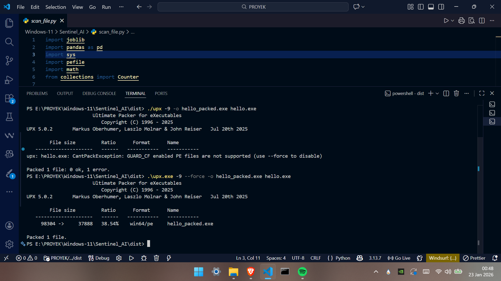
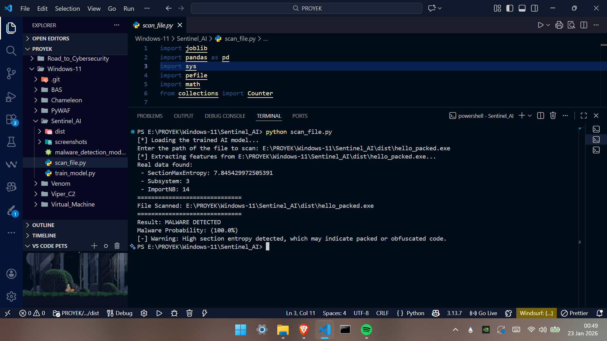

# ML-Based Malware Detector

## Overview

This project is a next-generation static analysis tool designed to detect malicious executables without running them. Unlike traditional antivirus software that relies on database signatures (hashes), this project utilizes Machine Learning and Randmo Forest Algorithm to identify suspicious characteristics in the file structure. The system analyzes the Portable Executable (PE) Header to extract critical features, specifically Shannon Entropy and Import Address Table (IAT) size to classify files as "Benign" or "Malware" with high probability.

## Key Features 

### 1. Feature Engineering
* Indicates that the code is packed, compressed, or encrypted, a common technique used by malware to hide its payload from reverse engineering.
* Legitimate software usually imports hundreds of system functions (APIs). Malware often hides its imports or uses packing tools, resulting in a suspiciously low number of visible imports.

### 2. Random Forest Classifier
* Uses `sklearn.ensemble.RandomForestClassifier` to build a robust decision model.
* Trained on a synthetic dataset that simulates the attributes of packed malware vs. standard Windows applications.

### 3. PE File Parsing
* Utilizes the `pefile` library to dissect Windows `.exe` binaries and calculate mathematical entropy on the fly.

## Architecture

1.  **Training Phase** 
    * Generates a dataset of 2000 samples (Malware vs Benign) and trains the AI. The model is saved as `malware_detection_model.pkl`.
2.  **Scanning Phase** 
    * Loads the trained model, extracts features from a target file, and predicts its malicious probability.

## Demo & Proof of Concept

### 1. Model Training
The AI is initialized and trained. As seen below, it achieves high accuracy on the validation set by learning the correlation between High Entropy and Low Imports.

### 2. Scanning a Clean File
We tested the model against a legitimate Windows executable (`Notepad.exe`).

### 3. Malware Simulation (The Attack)
To test the AI's detection capabilities, we created a Simulated Malware. We copy `whoami.exe` from the system to a new file `hello.exe` and obfuscated it using UPX (Ultimate Packer for eXecutables) with the `--force` flag. This artificially inflated the entropy and destroyed the import table—mimicking real malware behavior.

### 4. Malware Detected
When scanning the packed file (`hello_packed.exe`), the model immediately flagged it.

## Prerequisites

* Python 3+
* pandas
* scikit-learn
* pefile
* joblib

---
* Created by: Yustinus Hendi Setyawan
* Date: Thursday, December 25 2025