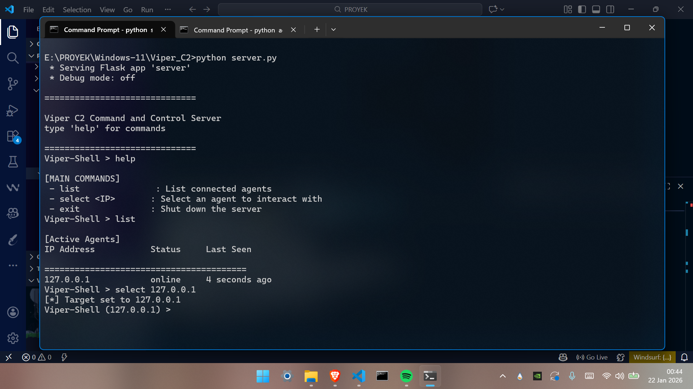
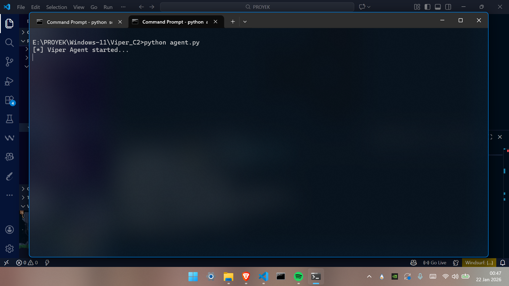
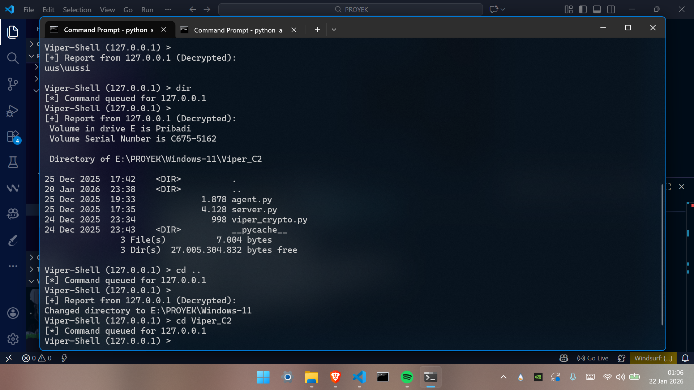
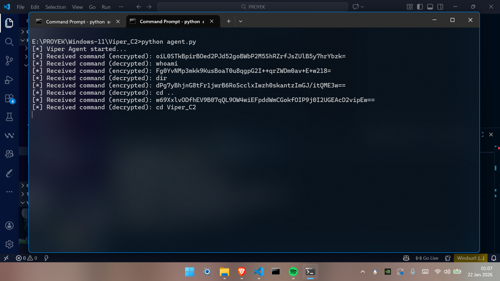

# Viper C2 Framework

## Overview

Viper C2,is a lightweight and stealthy Command & Control (C2) framework designed for Red Team operations. Unlike simple reverse shells, Viper utilizes a client-server architecture where multiple agents communicate via encrypted HTTP beacons. The core strength of this framework is its focus on Operational Security (OpSec). All network traffic between the Agent and the Server is encrypted using AES-256-GCM, ensuring that commands and results remain confidential and invisible to standard network monitoring tools.

## Key Features

### 1. Military-Grade Encryption
* Implements AES-GCM (Galois/Counter Mode) for authenticated encryption of all payloads.
* Protects C2 traffic from interception and analysis by Blue Teams or NIDS (Network Intrusion Detection Systems). Even if packets are captured, only random encrypted blobs are visible.

### 2. Stealthy Beaconing & Jitter
* Agents do not maintain a persistent TCP connection. Instead, they "poll" the server periodically for commands.
* Implements a "Jitter" mechanism (Randomized Sleep) to avoid heartbeat-based anomaly detection.
* Mimics legitimate web traffic patterns to evade firewall blocking.

### 3. Multi-Agent Management
* The server features a concurrent connection handler allowing multiple agents to check in simultaneously.
* Provides a centralized CLI dashboard to list active agents, select specific targets, and queue commands asynchronously.

### 4. Remote Command Execution
* Supports full system shell execution (`subprocess`) and persistent directory navigation (`cd` command).
* Captures standard output (stdout) and standard error (stderr), encrypts them, and sends them back to the server for display.

## Architecture

1.  **Viper Server**
    * Hosts a Flask web server on port 5000 to listen for incoming beacons.
    * Runs a dedicated CLI thread for the operator to issue commands (`help`, `list`, `select`).

2.  **Viper Crypto**
    * Handles the AES-GCM encryption and decryption logic for both the agent and the server, ensuring a shared secure channel.

3.  **Viper Agent**
    * Running on the victim machine, it sends `GET` requests to `/heartbeat` to retrieve encrypted commands and `POST` requests to `/result` to submit encrypted output.

## Demo & Proof of Concept

### 1. Server Initialization
The server is started, initializing the Flask listener and the interactive CLI. It is now ready to accept incoming connections from agents.

### 2. Agent Initialization
Agent is starting and ready to receive command from server.

### 3. Command Execution
The operator selects a target from the list and executes commands like `dir` and `whoami`. The server successfully decrypts the received response and displays the clean output to the attacker.

### 4. Command Encryption
As shown below, the agent receives encrypted strings, proving that the actual commands are hidden from the network view.

## Prerequisites

* Python 3+
* Flask Library

---
* Created by: Yustinus Hendi Setyawan
* Date: Wednesday, December 24 2025